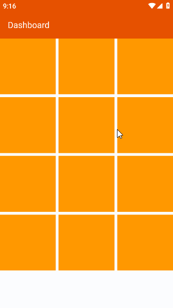
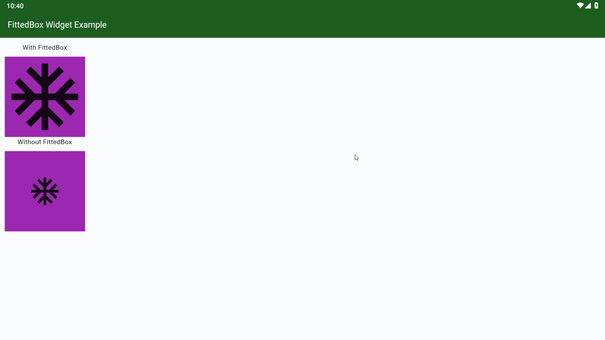

# Intensive Course Fullstack

## Folders
### Chapter 1 ✅
  - Learn & Practice Basic Dart
    - Variable
    - Operator
    - Null Safety
    - IF Statement
    - List dan Map
  - Practice from around 130 exercises
  - I Got Point 130 of 100(requirement)
### Chapter 2 ✅
  - Learn concept looping
  - Study case of looping
  - Practice from around 135 exercises
  - I Got Point 135 of 100(requirement)
### Chapter Layout ✅

#### 1. Grid View

#### 2. Fitted Box

#### 3. Layout Builder

[Layout Builder Preview Video](https://onelineplayer.com/player.html?autoplay=false&autopause=false&muted=false&loop=true&url=https://github.com/lypsisrudiansyah/intensive_course_fullstack/raw/master/chapter_layout/previews/0%20flutter%20layoutBuilder%20for%20responsive.mp4&poster=&time=true&progressBar=true&overlay=true&muteButton=true&fullscreenButton=true&style=light&quality=auto&playButton=true)

#### 4. Orientation Builder Example

[Orientation Builder Preview Video](https://onelineplayer.com/player.html?autoplay=false&autopause=false&muted=false&loop=true&url=https://github.com/lypsisrudiansyah/intensive_course_fullstack/raw/master/chapter_layout/previews/0%20orientation%20builder%20for%20responsive.mp4&poster=&time=true&progressBar=true&overlay=true&muteButton=true&fullscreenButton=true&style=light&quality=auto&playButton=true)

#### 5. Media Query Example

[Media Query Preview Video](https://onelineplayer.com/player.html?autoplay=false&autopause=false&muted=false&loop=true&url=https%3A%2F%2Fgithub.com%2Flypsisrudiansyah%2Fintensive_course_fullstack%2Fraw%2Fmaster%2Fchapter_layout%2Fpreviews%2F0%2520overflow%2520handling%2520and%2520responsive%2520mediaquery.mp4&poster=&time=true&progressBar=true&overlay=true&muteButton=true&fullscreenButton=true&style=light&quality=auto&playButton=true)
